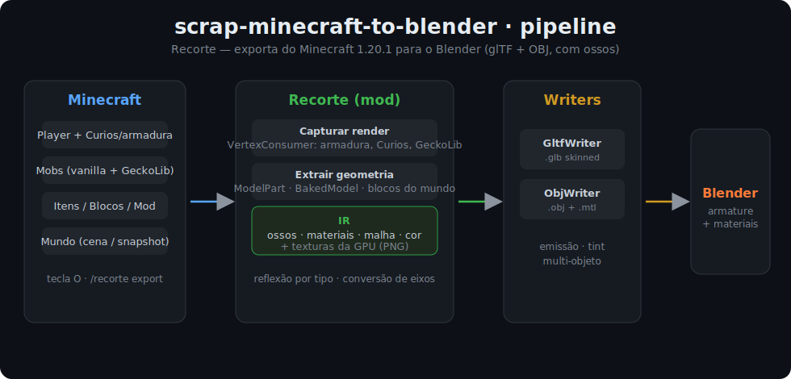

# scrap-minecraft-to-blender

**🌐 Idioma:** [English](README.md) · **Português**

[](LICENSE)


> **Recorte** — exporte (quase) qualquer coisa do Minecraft direto pro **Blender**: seu personagem,
> mobs, itens, blocos, mods inteiros, **cenas do mundo** e **cinematics** completos — com **esqueleto
> (ossos)**, **animações gravadas suaves** (keyframes editáveis), **iluminação bakeada**, **PBR** de
> resource pack, **múltiplas câmeras**, **timelapse dia/noite** e **markers** de quebra/som na timeline,
> em **glTF (`.glb`)** e **OBJ**.

Mod **client-side** para **Minecraft 1.20.1 / Forge**. Você aperta uma tecla (ou usa um comando) dentro
do jogo e os arquivos aparecem prontos pra importar no Blender.



---

## ✨ O que dá pra exportar

| Comando | O que faz | Ossos |
|---|---|:---:|
| `O` (tecla) ou `/recorte export` | o player/mob que você está **olhando**, ou você | ✅ |
| `/recorte export player <nome>` | um player pelo nome | ✅ |
| `/recorte export entity <id>` | um **mob** (ex.: `minecraft:zombie`) | ✅ vanilla¹ |
| `/recorte export item <id>` | modelo 3D de um **item** (espada, ovo…) | – |
| `/recorte export held` | o item que você está **segurando** (mão principal) — sem precisar de id | – |
| `/recorte export block <id>` | modelo de um **bloco** | – |
| `/recorte export block` (sem id) | o **bloco/objeto que você está olhando** (baús, máquinas, placas vêm com o estado real + block entity) | – |
| `/recorte export mod <modid>` | **todos** os itens + blocos **+ entidades** de um mod (lote) **+ um catálogo `manifest.json`** | ✅ |
| `/recorte export animlib` | uma **biblioteca de animações** do player (idle/walk/run/sneak) num rig | ✅ |
| `/recorte export retarget` | o player com **nomes de osso humanóides estilo Mixamo** (Hips/Spine/Head/braços/pernas) pra retargeting | ✅ |
| `/recorte export scene [raio]` | 🎬 **cenário** ao redor (diorama do seu build/terreno) | – |
| `/recorte export snapshot [raio]` | 🎬 **o momento**: cena + **todas as entidades** por perto (mobs rigados; molduras, quadros, barcos, carrinhos, itens no chão… capturados) | ✅ |
| `/recorte export region <de> <até>` | uma **caixa** precisa entre dois cantos (uma build inteira), enquadrada e iluminada | – |

¹ Mobs vanilla (`HumanoidModel`/`HierarchicalModel`) saem **com ossos**. Mobs de **GeckoLib** caem
para uma captura estática (mas saem!).

### 🎥 Gravar animação ao vivo & cinematics

| Comando / tecla | O que faz |
|---|---|
| `R` (tecla) ou `/recorte record start` … `stop` | grava **um mob/player**: membros **e** o caminho no mundo → animação glTF com keyframes |
| `/recorte record scene start [raio]` … `stop` | 🎬 **cinematic**: o momento inteiro — cena + cada entidade animando (mobs rigados; barcos/carrinhos/itens pelo caminho; **cavaleiros parentados à montaria**) + **câmera POV animada** + sol + céu |
| `/recorte live` | link em tempo real: o mod auto-exporta ~1×/s e o addon do Blender re-importa enquanto você joga |
| `/recorte cam add <nome>` (· `clear` · `list`) | 🎥 larga uma **câmera nomeada** no seu olho; toda cena/snapshot/cinematic leva as câmeras posicionadas pro Blender |
| `/recorte cam path <segundos>` | 🎬 um **flythrough** suave passando a câmera pelas câmeras posicionadas — câmera animada sobre a cena |
| `/recorte cam shake <0-10>` | 🤳 adiciona **tremida de câmera** na mão à animação de câmera gravada/flythrough (0 = desliga) |
| `/recorte ghost add` (· `clear` · `export`) | 👻 **onion-skin**: tira fantasmas esmaecidos de uma entidade (mexe, tira, repete) e exporta todos esmaecendo do mais antigo ao mais novo |
| `/recorte take start [nome]` (· `stop` · `export` · `list` · `clear`) | 🎬 **takes**: grave o mesmo sujeito várias vezes no mesmo rig; cada take é um clip nomeado → `take export` escreve todos num glTF multi-clip (uma Action cada) pra comparar e escolher o melhor |
| `/recorte slowmo <1-16>` | 🐢 **câmera lenta**: as próximas gravações/takes/cinematics amostram N× mais denso e esticam os tempos ×N → câmera lenta suave N× a 30 fps (1 = tempo real) |
| `/recorte shot <nome>` | 🎬 **marcador de shot**: durante um cinematic, nomeie um corte no tempo atual → um marker nomeado limpo na timeline do Blender (`🎬 <nome>`) + um `shots.csv` |
| `/recorte preset save` (· `load` · `list`) `<nome>` | 💾 **presets**: salve/carregue configs do estúdio (raio, slow-mo, shake, fps, DOF) como arquivos JSON nomeados — ajuste um visual uma vez, recarregue na próxima sessão |

As gravações são amostradas **por frame renderizado com interpolação (~30 fps)**, então o movimento
fica liso, não travado no tick de 20 Hz. O addon puxa o clip pra Action ativa, então as **keys aparecem
na Timeline** prontas pra editar.

**Extras automáticos:**
- 🦴 **Esqueleto/armature** pronto pra animar (player e mobs).
- 🎨 **Texturas** recortadas por sprite (pequenas, não o atlas inteiro).
- 💡 **Emissão** — lava, glowstone, tochas e lanternas **brilham** no Blender.
- 🌿 **Tints** de bioma (grama/folha/água) como **cor de vértice**.
- 🔆 **Iluminação bakeada** — block + sky light e sombreamento de face na cor de vértice; a cena já vem
  iluminada como no jogo.
- 🧱 **Culling** das faces escondidas + **block entities** (baús, placas, estandartes, camas…) nas cenas.
- 📷 **Multi-câmera** — `scene`/`snapshot`/cinematic exportam a câmera POV do jogo **+** câmeras de
  render (orbital + topo) + as que você colocou com `/recorte cam add`.
- 🔭 **Depth of field** — a câmera POV/colocadas focam no que você está olhando (com f-stop); o addon
  liga o DOF do Blender pra desfocar o fundo de forma cinematográfica.
- ☀️ **Sol** — luz direcional pela hora do dia; cinematics animam um **timelapse dia/noite** (sol + céu).
- 🧩 **Render passes** — o addon dá IDs de objeto e liga os passes Z/normal/mist pra composição.
- 🪨 **PBR de resource pack (LabPBR)** — normal map `_n` + specular `_s` → metallic-roughness do glTF.
- 🎚️ **Markers na timeline** — quebra/colocação de blocos e sons viram markers no Blender (+ `events.csv`).
- 🌊 **Texturas animadas** — água/lava/fogo/portal usam o frame correto, a **sequência de frames** inteira
  é exportada, e o addon **monta sozinho um Image Sequence em loop** por material, então elas **correm de
  verdade** no Blender enquanto a cena toca.
- 💧 **Superfícies de fluido** — água e lava (antes puladas, por não terem modelo de bloco) agora
  exportam a **superfície de cima e as laterais expostas** (cachoeiras, bordas de poça) na altura real,
  com tint de bioma/emissão, num objeto `Fluids`.
- 🪟 **Transparência real** — vidro, vidro tingido, gelo e água saem como **BLEND** do glTF (vê-se
  através de verdade); os recortes pixel-art (folhas, grama) continuam nítidos em MASK.
- 👕 Armadura, itens nas duas mãos e **acessórios Curios/Artifacts** (objeto `Accessories` separado); a
  **capa/elytra** vem como objeto `Cape` próprio.
- ✨ **Partículas / VFX point cloud** — `scene`/`snapshot` capturam toda partícula viva (fogo, fumaça,
  portal, redstone…) como uma **nuvem de pontos** glTF (objeto `Particles`); cada ponto guarda a cor,
  pronta pra alimentar **Geometry Nodes** (instanciar um billboard ou volume em cada ponto) e gerar VFX
  com qualidade de render.
- 🔦 **Feixes de beacon** — o feixe de um beacon ativo é exportado como uma **cruz emissiva** alta (objeto
  `Beams`), colorida pelo vidro tingido acima dele, então raios de luz brilhantes sobem pela sua cena no
  Blender.
- 🌧️ **Clima** — quando está chovendo/nevando, o volume da cena se enche de uma **nuvem de pontos de
  precipitação** (objeto `Weather`): chuva (azul-acinzentada) ou neve (branca) pelo bioma, densidade pela
  força da tempestade — instancie um risco/floco por ponto com Geometry Nodes e anime a queda.
- 🌌 **Domo de céu + nuvens** — `scene`/`snapshot` envolvem a cena num **domo `Sky`** colorido por
  vértice (gradiente da cor real do céu no zênite até um horizonte enevoado) mais uma camada procedural
  de **`Clouds`** (auto-iluminada) na altura de nuvem da dimensão — um céu visível e renderizável, não só
  o fundo do World.
- 🔊 **Som → Speakers** — todo som tocado durante uma gravação de cinematic é exportado como um nó
  `Speaker` posicionado (deduplicado por lugar, com o id do som + tempo); o addon cria um objeto
  **Speaker** do Blender em cada um, pronto pra áudio espacial no Video Sequence Editor.

---

## 🚀 Instalação

1. Tenha **Minecraft 1.20.1** com **Forge 47.x**.
2. Baixe/gere o `recorte-0.1.0.jar` (veja **Build** abaixo) e jogue na pasta `mods` da sua instância.
3. Pronto. O mod é só-cliente; pode usar em mundo single-player ou em servidores.

## 🔨 Build (a partir do código)

Requisitos: nada além do repositório — o Gradle Wrapper baixa tudo (inclusive um **JDK 17** via toolchain).

```bash
# Windows
.\gradlew.bat build
# Linux/Mac
./gradlew build
# Resultado: build/libs/recorte-0.1.0.jar
```

Rodar um cliente de teste (dev): `./gradlew runClient`

> Obs.: mods com mixins (Oculus/Embeddium) **não** carregam no `runClient` de dev por diferença de
> mapeamento. Para testar junto com esses mods, instale o `.jar` na sua instância real.

---

## 🎮 Como usar

1. Entre num mundo.
2. Aperte **`G`** para o **painel de controle** (botões pra cada export, um **navegador buscável de
   items/blocks** (digite pra filtrar, clique num resultado pra exportar), botões **Looked-at block** /
   **Held item**, e uma **miniatura top-down ao vivo** do que a cena/snapshot vai capturar), **`O`**
   (rebindável em *Opções → Controles → Recorte*) pra exportar, ou use um `/recorte export …`.
3. Os arquivos saem em `<pasta da instância>/recorte_exports/<data_hora>_<nome>/` (`.glb`, `.obj`/`.mtl`, `.png`).

### Exemplos
```
/recorte export entity minecraft:zombie
/recorte export item minecraft:diamond_sword
/recorte export block minecraft:furnace
/recorte export mod artifacts          # itens + blocos + entidades do mod
/recorte export animlib                # Actions idle/walk/run/sneak no seu rig
/recorte export scene 12
/recorte export snapshot 16
/recorte record scene start 16         # …aja no jogo… depois:
/recorte record scene stop             # → cinematic animado com câmera POV + markers
```

## 🟦 Abrir no Blender

- **glTF (recomendado):** `Arquivo → Importar → glTF 2.0` e escolha o `.glb`.
- Visual **pixel-art** sem borrão: troque o filtro da textura para **Closest**.
- **Emissão** (lava/glowstone): `emissiveFactor`/`emissiveTexture` (EEVEE/Cycles).
- **Tints** (grama/água): *Color Attribute* (`COLOR_0`). Escala: 1 unidade = 1 bloco.

## 🔌 Link ao vivo — addon do Blender (importar com 1 clique)

Com o jogo aberto, o mod serve o último export em `http://127.0.0.1:25599`. Instale o addon e importe
sem mexer em arquivos:

1. Blender → *Edit → Preferences → Add-ons → Install…* → escolha `blender_addon/recorte_import.py` → ative.
2. Na viewport aperte **N** → aba **Recorte**.
3. Exporte no jogo (tecla `O`) e clique **Import latest from Minecraft**.

O **Import latest** faz mais que importar: filtro pixel-art (Closest), puxa as animações pra Action ativa
(as **keys aparecem na Timeline**), cria **markers** de quebra/som, keyframa o **timelapse dia/noite**
(Sun + fundo do mundo) e liga os **render passes**. O botão **Show animation keys** reativa animações de
arquivos importados na mão. Em **arquivos multi-clip** (biblioteca de animações, takes) o primeiro clip é ativado (keys visíveis) e
o resto fica como **strips de NLA** pra blending não-linear — o botão **Stack clips as NLA** empilha
todos na NLA. Com **Studio scene** ligado, ele ainda deixa a cena **pronta pra render** —
câmera ativa, fps/resolução, color management fiel, clipping seguro pro domo de céu e glow do EEVEE (o
botão **Setup studio scene** reaplica). **Live:** rode `/recorte live` e clique **Start Live link** — o
mod auto-exporta a cena ao redor a cada ~2s e o Blender re-importa sozinho.

---

## 🧠 Como funciona

- **Reflexão por *tipo de campo*** (não por nome) → funciona no dev e no jogo ofuscado, sem *access transformer*.
- **Captura do render real** num `VertexConsumer` → pega armadura, Curios e GeckoLib sem conhecer cada sistema.
- **Conversão de eixos** centralizada; geometria capturada já vem ÷16 do jogo.

Detalhes da arquitetura no [README em inglês](README.md#-how-it-works) e em [CONTRIBUTING.md](CONTRIBUTING.md).

## 🗺️ Roadmap

Animações, VFX/partículas, iluminação, addon de Blender e mais em **[ROADMAP.md](ROADMAP.md)**.

## 📄 Licença

[MIT](LICENSE).
